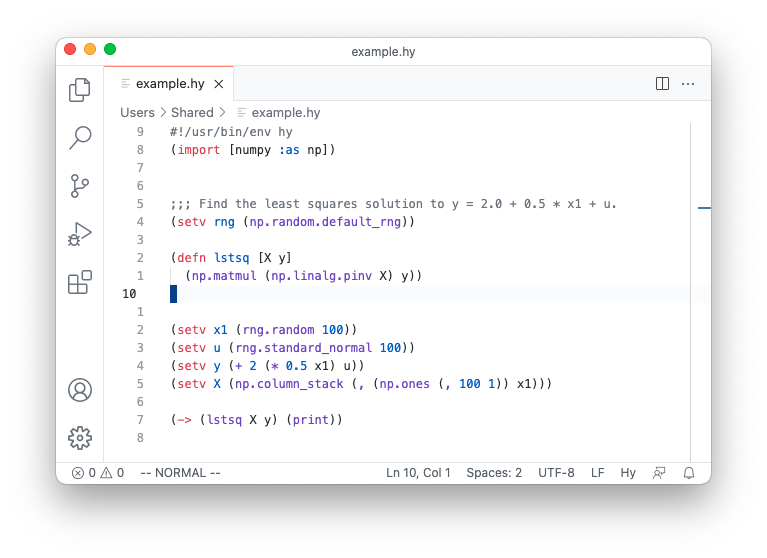

# Hy Language Support in Visual Studio Code

An extension that provides syntax highlighting and bracket matching in Hy files for Visual Studio Code.

It is based on [Visual Studio Code's native extension for Clojure](https://github.com/microsoft/vscode/tree/master/extensions/clojure).

